# Intermediate Representation

使用syntax-directed transition来生成IR

进行与机器无关的分析和优化

- 分析
  - 类型推断（Type inference）：自动推断变量的类型。
  - 错误检测（Bug detection）：发现代码中的潜在错误。
  - 代码插桩（Code instrumentation）：为代码添加额外的功能，如日志记录或防御攻击的代码。
- 优化
  - 删除无用代码（Dead code elimination）：移除永远不会执行的代码。
  - 常量传播（Constant propagation）：将常量表达式提前计算。
  - 变量活性分析（Live variable analysis）：确定哪些变量在程序的哪些部分是活跃的。
  - 向量化（Vectorization）：将标量操作转换为向量操作，以提高性能。
  - ..............

## Three-Address Code

三地址码

- 右侧最多一个操作符
- 一条指令中最多三个地址/变量

形如 x = y op z

可以用三元组或者四元组来实现

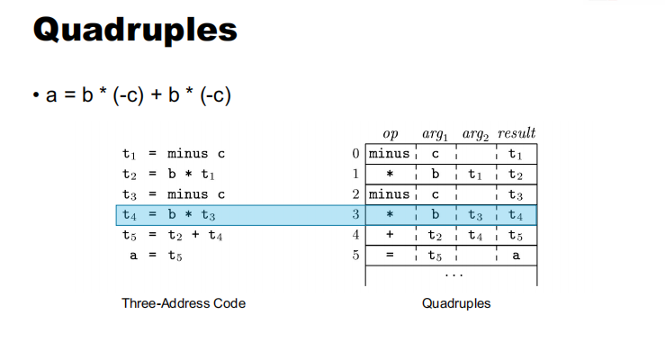

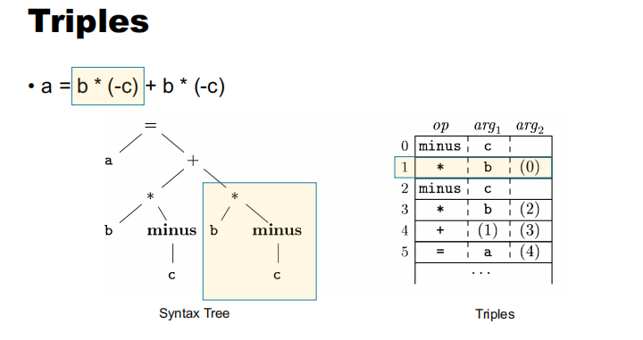

这里的（0）指的是第0步的计算结果

## Syntax-Directed Translation

- SDD = Context-Free Grammar + Attributes + Rules     Syntax-Directed Definition
- 属性与文法中的符号相关联 
- 规则与文法中的产生式相关联

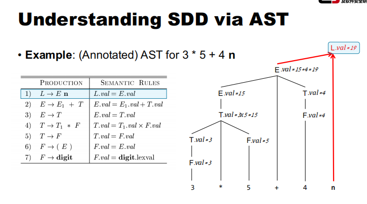

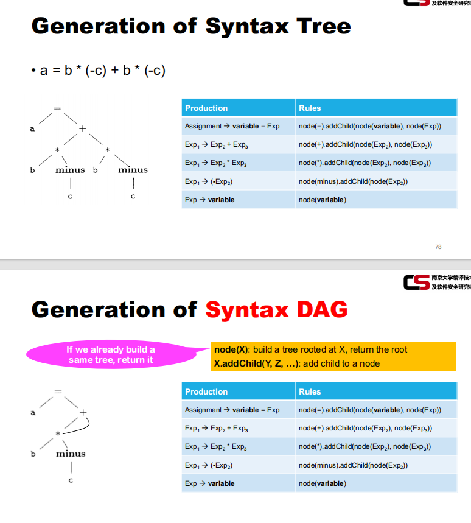

这里的语法树，就是对应右边的规则 比如第一条规则，指碰到赋值语句则构造一个以=为根节点，子节点为variable和Exp的树

## Translating Variable Declarations

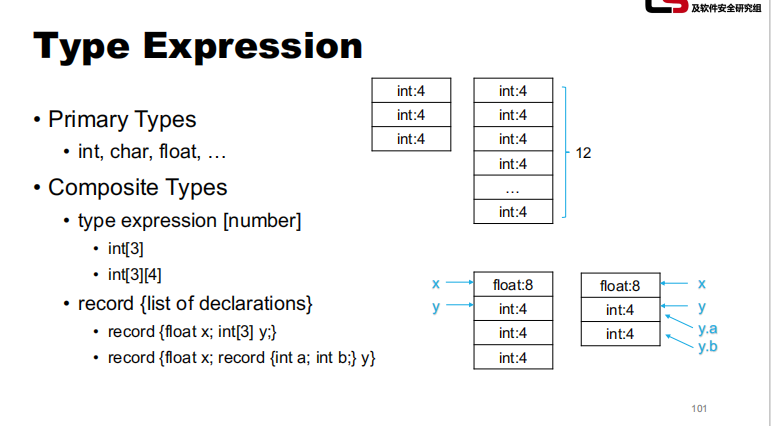

基本类型 复合类型（数组 记录类型（结构体））

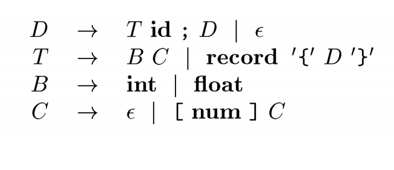

这里面D表示赋值语句 

T是Type

B表示基本类型

C表示数组维度

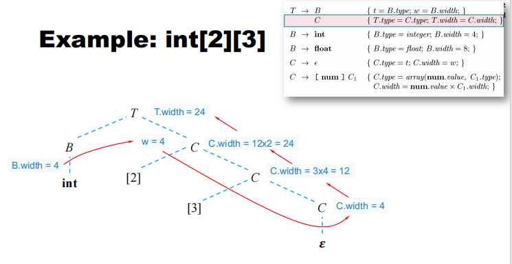

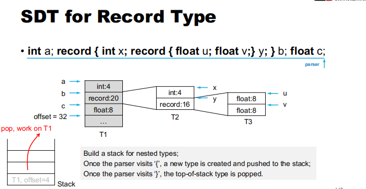

## Translating Statements

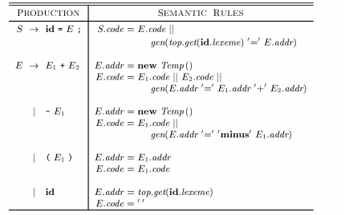

1. S → id = E ;

- **S.code = E.code || gen(top.get(id.lexeme) '=‘ E.addr)**
  - **S.code**：表示当前产生式生成的中间代码。
  - **E.code**：表示表达式 E 生成的中间代码。
  - **gen(top.get(id.lexeme) '=‘ E.addr)**：生成一条中间代码，将表达式 E 的值（E.addr）赋值给变量 id。
  - **||**：表示代码拼接，将 E.code 和新生成的赋值代码连接起来。

2. E → E1 + E2

- **E.addr = new Temp()**
  - **E.addr**：表示当前表达式的地址，这里创建一个新的临时变量。
- **E.code = E1.code || E2.code || gen(E.addr '=‘ E1.addr '+' E2.addr)**
  - **E1.code** 和 **E2.code**：分别表示子表达式 E1 和 E2 生成的中间代码。
  - **gen(E.addr '=‘ E1.addr '+' E2.addr)**：生成一条中间代码，将 E1 和 E2 的值相加，并将结果存储在 E.addr 中。
  - **||**：表示代码拼接，将所有子表达式的代码和新生成的代码连接起来。

3. E → - E1

- **E.addr = new Temp()**
  - **E.addr**：表示当前表达式的地址，这里创建一个新的临时变量。
- **E.code = E1.code || gen(E.addr '=‘ '-' E1.addr)**
  - **E1.code**：表示子表达式 E1 生成的中间代码。
  - **gen(E.addr '=‘ '-' E1.addr)**：生成一条中间代码，对 E1 的值取负，并将结果存储在 E.addr 中。
  - **||**：表示代码拼接，将子表达式的代码和新生成的代码连接起来。

4. E → ( E1 )

- **E.addr = E1.addr**
  - **E.addr**：直接使用子表达式 E1 的地址。
- **E.code = E1.code**
  - **E.code**：直接使用子表达式 E1 生成的中间代码。

5. E → id

- **E.addr = top.get(id.lexeme)**
  - **E.addr**：获取变量 id 的地址，通过符号表（top.get）获取。
- **E.code = ''**
  - **E.code**：没有额外的中间代码生成，因为只是简单地引用了一个变量。

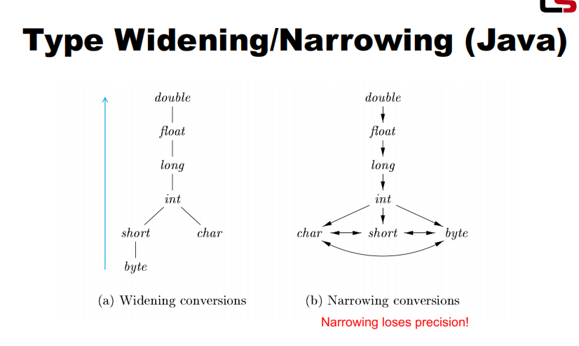

## Translating Control Flows

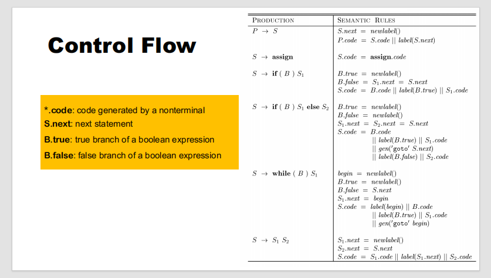

每次都会给下一个语句创建一个label，类似于汇编中那种记录语句位置用于跳转的东西

while那个里面的begin对应的是如果B是true，goto S1.code，否则goto B.false

整个相当于是维护了一个链表，程序按照链表顺序执行

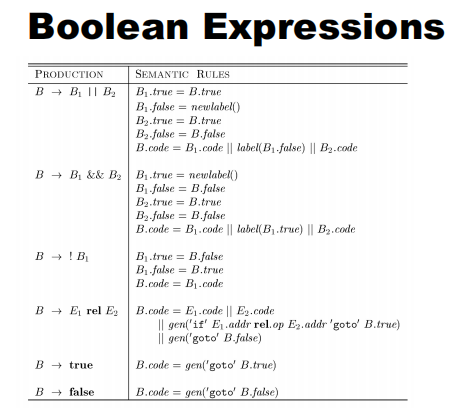

