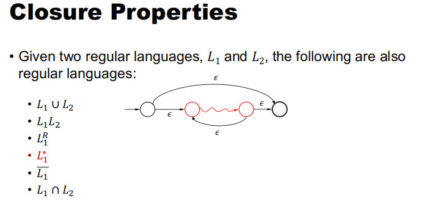
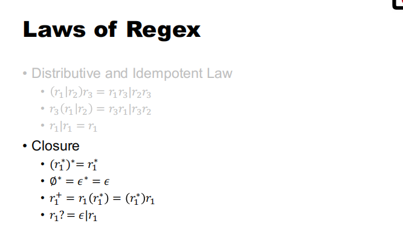
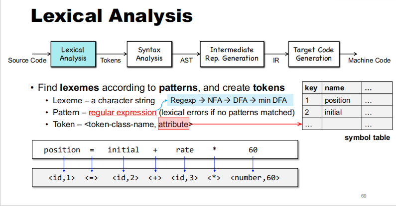
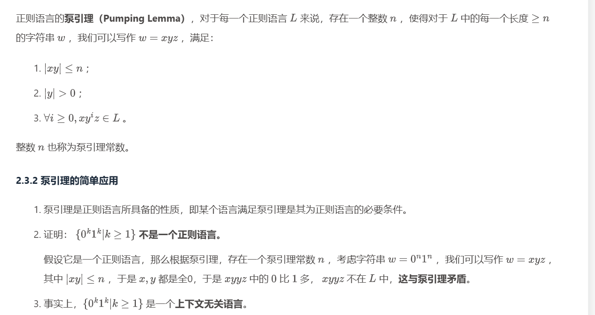

# Lexical Analysis

词法分析

## Regular Language

正则语言

说白了就是能被DFA accept的语言

## Regular Expression（Regex）

基本正则表达式

- **空集**：∅，表示不匹配任何字符串。
- **空字符串**：ε，表示匹配空字符串。
- **单个字符**：a，表示匹配字符'a'。

正则表达式构造规则

给定两个正则表达式 *r*1 和 *r*2，可以构造出新的正则表达式：

1. **选择（并）**：*r*1∣*r*2，表示匹配 *r*1 或 *r*2。
2. **连接（乘积）**：*r*1*r*2，表示匹配 *r*1 后跟 *r*2。
3. **闭包（克林星号）**：*r*1，表示匹配零个或多个 *r*1 的连接。
4. **括号**：(*r*1)，用于改变运算的优先级。

任何regex都代表一个Regular Language

任何regular language都能被regex表示 

## Lexical Analysis

## Pumping Lemma

泵引理

