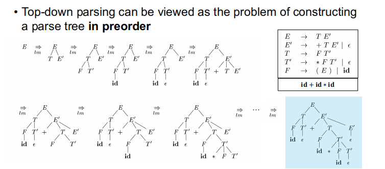
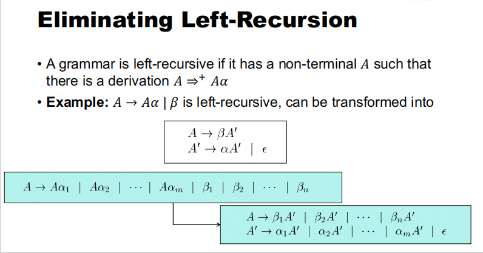
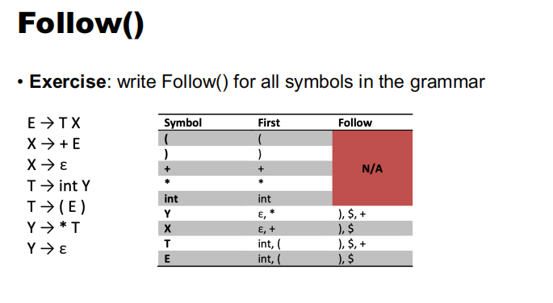
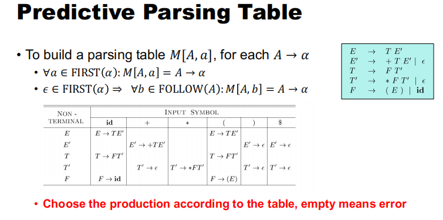
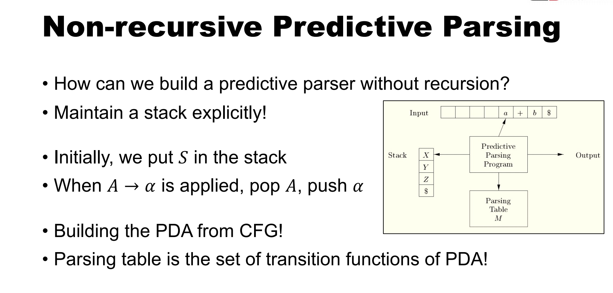
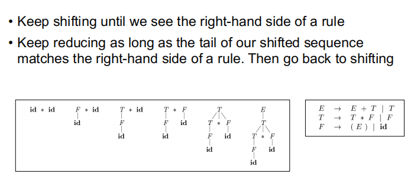
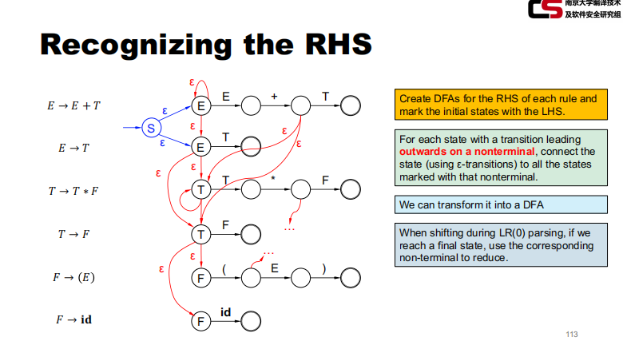

# Syntax Analysis

建立语法树的过程

## Top-Down Parsing

用先序构造一个语法树



代码方面举个例子，比如对于S->c A b

```java
bool S() {
    if (*cursor == 'c') cursor++; // 匹配 'c'
    else return false;
    if (!A()) return false;       // 调用函数 A()
    if (*cursor == 'b') cursor++; // 匹配 'b'
    else return false;
    return true;
}
```

但是这样可能会出现一些匹配的问题，比如多种可选匹配组合下，如果按照这个代码跑就会漏掉一些情况，所以需要回溯等方法来处理 再比如可能会出现死循环



LL(1) 是一种具体的预测解析方法：  无二义性 无死循环

- **第一个 L** 表示从左到右扫描输入字符串。
- **第二个 L** 表示使用最左推导（leftmost derivation），即在每一步推导时，总是展开最左边的非终结符。
- **1** 表示在每一步解析时使用一个输入符号进行前瞻，以决定下一步的解析动作

FIRST(A)：FIRST(A) 是一个集合，包含非终结符A能够推导出的所有可能的开头终结符。如果A能够推导出空字符串ε，那么FIRST(A)也包含ε

- 如果A是一个终结符，那么FIRST(A) = {A}。
- 如果A是一个非终结符，那么：
- - 对于A的每个产生式A → α，将α的第一个符号的FIRST集加入FIRST(A)中，直到遇到一个不包含ε的符号。
  - 如果α可以推导出ε，那么将ε加入FIRST(A)。

FOLLOW(A)：FOLLOW(A) 是一个集合，包含所有可能出现在非终结符A后面的终结符。这些终结符是在语法树中直接跟在A后面出现的。

- 初始化FOLLOW(开始符号)为{}，其中是输入结束标志。
- 对于每个产生式A → αBβ：
- - 将FIRST(β)中的所有终结符（不包括ε）加入FOLLOW(B)。
  - 如果β可以推导出ε，或者β是空，那么将FOLLOW(A)中的所有符号加入FOLLOW(B)。
- 重复上述步骤直到FOLLOW集不再变化。







## Bottom-up Parsing

后序遍历



LR(0) 解析的特点

- **从左到右扫描**：LR(0) 解析器从左到右扫描输入字符串。
- **最右推导**：LR(0) 解析器使用最右推导（right-most derivation），即在每一步推导时，总是展开最右边的非终结符。
- **零个符号的前瞻**：LR(0) 解析器在解析过程中不需要使用前瞻符号来做出决策。这意味着解析表的构造相对简单，但适用范围有限。

