# Translation into SSA Form

## SSA and Extensions

Static Single-Assignment

静态单赋值

- **唯一赋值**：在SSA形式中，每个变量只被赋值一次。如果一个变量在原始代码中被多次赋值，则在转换为SSA形式时，每次赋值都会创建一个新变量。
- **Φ函数**：在控制流图（CFG）中，当有多个控制流路径合并时，需要引入Φ（phi）函数来选择来自不同路径的变量值。Φ函数的形式是`x = Φ(x1, x2, ...)`，表示变量`x`的值根据来自不同路径的变量`x1`, `x2`, …进行选择。

- **变量版本号区分**：为了确保每个变量在SSA形式中只被赋值一次，需要一种机制来区分同一变量在不同赋值点的不同版本。通常通过在变量名后添加下标或其他标识符来实现，例如，对于变量`x`，其不同的版本可以表示为`x1`、`x2`、`x3`等。

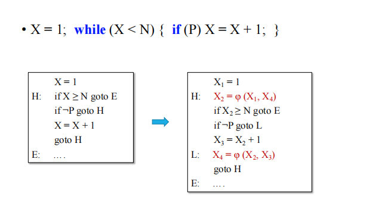

**Gated SSA**

门控静态单赋值

$\gamma$符号类似于一个门控节点，用于在多个可能的路径中选择一个合适的路径。它根据控制流中的条件来决定选择哪个路径的值。

μ（Mu）符号

- **位置与作用**：μ符号通常用于循环头部，表示循环的条件判断。它类似于一个门控节点，根据条件是否满足来决定是否进入循环体。

η（Eta）符号

- **位置与作用**：η符号通常用于循环退出点，表示循环变量在循环结束时的状态。它用于记录循环变量在循环结束时的值，以便在循环外使用。

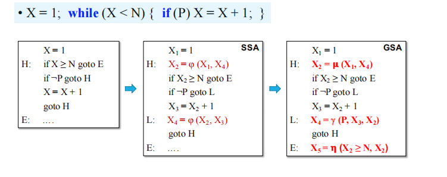

## LLVM IR

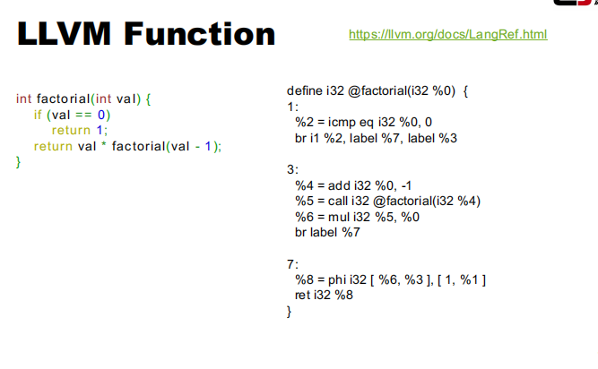

`iN`：N位的整数，如`i32`表示32位整数

数组类型：表示一个固定大小的数组，如`[4 x i32]`表示一个包含4个32位整数的数组。

结构体类型：表示一个结构体，如`%struct.Stu = type { i8*, i32, i8, float }`。

函数类型：表示函数的返回类型和参数类型，如`i32 (i32, i32)*`表示一个返回32位整数，接受两个32位整数参数的函数指针。

- **内存操作指令**：
  - `alloca`：在栈上分配内存。
  - `load`：从内存加载数据。
  - `store`：将数据存储到内存。
  - `getelementptr`：计算数组或结构体中元素的地址。
- **控制流指令**：
  - `br`：无条件跳转。
  - `condbr`：条件跳转。
  - `switch`：多路跳转。
  - `ret`：返回。
  - `invoke`：调用函数，并处理异常。
- **其它指令**：
  - `call`：调用函数。
  - `icmp`：整数比较。
  - `fcmp`：浮点数比较。
  - `phi`：Phi节点，用于处理控制流汇合处的值。

- 占位符以`%`开头，后跟一个数字或名称。
- 数字占位符（如`%1`、`%2`）是自动生成的，用于标识指令的结果。
- 名称占位符（如`%sum`）是用户或编译器定义的，用于标识变量或函数参数。

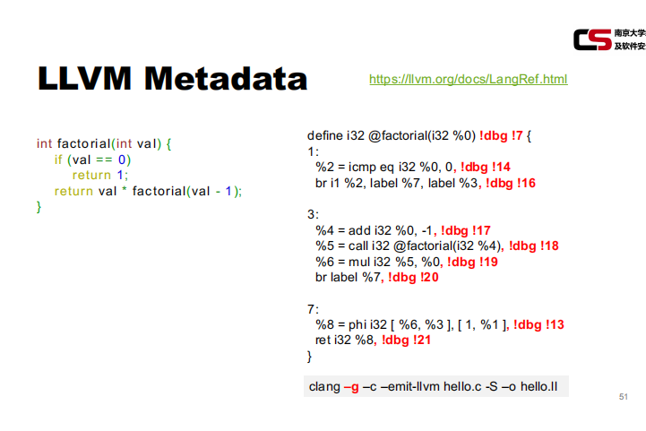

元数据 用于调试

- **`7`**：表示函数 `factorial` 的调试信息，包括函数名、文件名、起始行号等。
- **`!14`、`!16`、`!17` 等**：表示具体的调试表达式，通常用于表示源代码中的行号或列号。

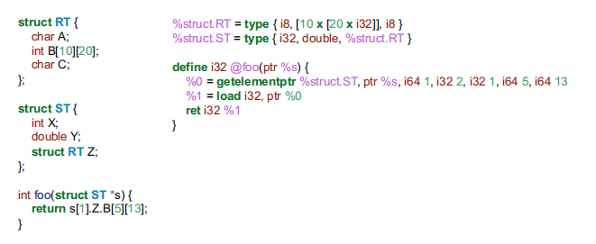

## Translation into SSA

Partition three-address code to basic blocks

• A basic block is a sequence of consecutive instructions 一个基本的块是一系列连续的指令序列

- 函数的第一个指令是引导指令
- 任何作为跳转目标的指令都是引导指令
- 任何跟随跳转的指令都是引导指令

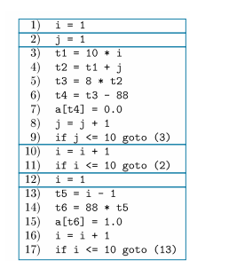

这张图就是通过找到所有的引导指令，从而根据引导指令划分basic block

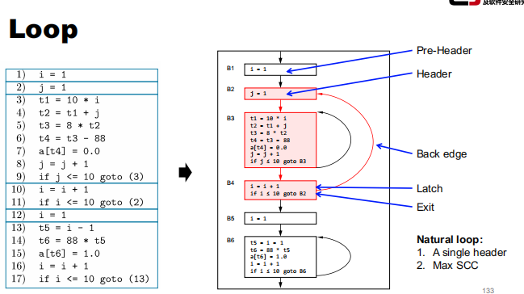

- **Pre-Header（预头部）**：B1 是预头部，包含 `i = 1` 的初始化。
- **Header（头部）**：B2 是头部，包含 `j = 1` 的初始化。
- **Back edge（后向边）**：从 B4到 B2 的边，表示内层循环的后向跳转。
- **Latch（锁存块）**：B4 是锁存块，包含 `i = i + 1` 和 `if i <= 10 goto B2` 的判断。
- **Exit（退出块）**：B5 和 B6 是退出块，表示循环结束后的代码。

- 自然循环由一个单一的头部（Header）和最大的强连通分量（SCC）组成。
- 图中 B2 到 B3 的循环是内层循环，B2 到 B4 的循环是外层循环。

**Dominance**

The header **dominates** all blocks in the loop.

- A **dom** B 
  -  if all paths from Entry to B goes through A
- A **post-dom** B
  - if all paths from B to Exit goes through A

- Strict (post-)dominance-A(post-)dom B but A≠B

- Immediate dominance – A strict-dom B, but there’s no C, such that A strict-dom C, C strict-dom B

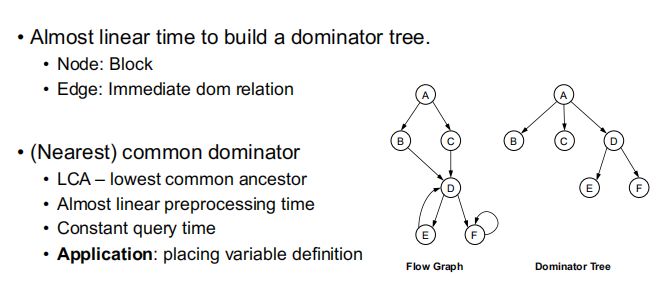

- **时间复杂度**：构建支配树的时间复杂度接近线性（`O(n)`），这使得它在处理大规模控制流图时非常高效。
- **节点**：支配树中的每个节点代表控制流图中的一个基本块（Block）。
- **边**：支配树中的边表示立即支配关系（Immediate Dom Relation）。

**最近公共支配节点（Nearest Common Dominator）**

- **最低公共祖先（LCA - Lowest Common Ancestor）**：在支配树中，两个节点的最低公共祖先是它们的最近公共支配节点。

**Dominance vs. Ctrl Dependence**

- Block B is control dependent on Block A if and only if
  - The execution(执行) result of A determines if B will be executed
- Block B is control dependent on Block A if and only if
  - A has multiple successors(继承者)
  - Not all successors can reach B
- By definition,we always need a forward traversal(遍历) from all successors of B to test if A ctrl-depends on B.  Too expensive!!

左边两张图是用上面的法则根据最右边的图画出来的

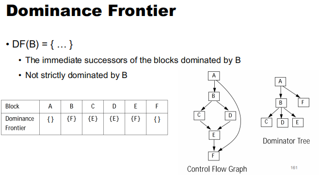

就是去找满足两个条件的

比如要找A的DF，那就在被A dominate的节点的后继中找不被A dominate的节点

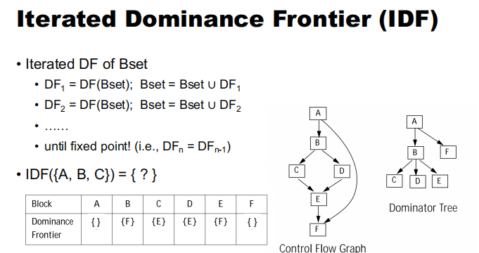

假设我们有一个块集 `Bset = {A, B, C}`，我们需要计算其 IDF。

1. **初始步骤**：
   - 计算 `DF₁ = DF({A, B, C})`。
   - 根据支配边界表：
     - `DF(A) = {}`
     - `DF(B) = {F}`
     - `DF(C) = {E}`
   - 所以 `DF₁ = {F, E}`。
   - 更新 `Bset = {A, B, C} ∪ {F, E} = {A, B, C, F, E}`。
2. **迭代步骤**：
   - 计算 `DF₂ = DF({A, B, C, F, E})`。
   - 根据支配边界表：
     - `DF(A) = {}`
     - `DF(B) = {F}`
     - `DF(C) = {E}`
     - `DF(F) = {}`
     - `DF(E) = {F}`
   - 所以 `DF₂ = {F, E}`。
   - 更新 `Bset = {A, B, C, F, E} ∪ {F, E} = {A, B, C, F, E}`。
3. **检查固定点**：
   - `DF₂ = DF₁`，达到固定点。

所以`IDE({A,B,C}) = {F, E}`

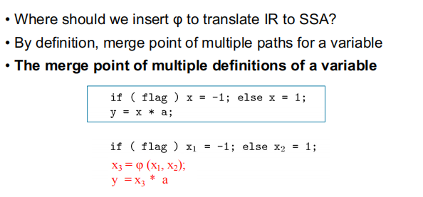

通过向上查找Dominator Tree去寻找对应的定义
